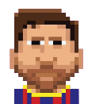

# Super Chrome Running Dinasour - T_Rex-NSH-Edition

- Giới thiệu game: https://youtu.be/v7n-TQNQvds

# Giới thiệu game

Super Chrome Running Dinasour là 1 game đơn giản kế thừa ý tưởng từ trò chơi khủng long ở trên trình duyệt Chrome.

Chướng ngại vật sẽ xuất hiện để cản bước chú khủng long.

Bạn có nhiệm vụ giúp chú khủng long vượt qua vật cản.

Khi đâm phải chướng ngại vật, game sẽ dừng lại, bạn sẽ thua và trò chơi sẽ kết thúc, điểm của bạn sẽ được hiện ra.

Vì đây là một đoạn đường dài vô tận với vô vàn những chướng ngại vật nguy hiểm, Super Chrome Running Dinasour có thể giúp người chơi giải trí sau những giờ học Lập Trình Nâng Cao căng thẳng.

# Cấu trúc game

Cấu trúc của game gồm có 2 phần chính:

- Khủng Long T-Rex
- Chướng ngại vật
## 1. Khủng long
Đây là nhân vật được lấy ý tưởng từ khủng long Chrome. Được vẽ lại bằng ứng dụng aseprite.

## 2. Chướng ngại vật 
Đây là những vật mà chú khủng long cùng với người chơi cần vượt qua bao gồm:
|                         | Chướng Ngại Vật	     | Nguồn ảnh |
|-------------------------------------------|----------------|----------------|
|   |   Cây xương rồng	  | https://pixelartmaker.com/art/1094083e72eb64e |
|   |   Messi	  | https://opensea.io/collection/cyberpunk-style-of-messi-nft/activity |
|   |   Kị sĩ diệt khủng long	  |https://pixelartmaker.com/art/be6419ade9c65c2|
|   |   Mastered Ultra Instinct Son Goku	  | https://www.tpsearchtool.com/images/goku-ultra-instinct-goku-ultra-instinct-pixel-art-anime |
|   |   Cú sát thủ	  |https://www.nicepng.com/ourpic/u2e6e6i1q8y3t4i1_baby-bird-pink-bird-pixel-art/|
|   |   Hatsune Miku	  | https://pixelartmaker.com/art/0928b9ffd615677 |

# Chức năng game
- Chú khủng long T-Rex tự động chạy với một tốc độ nhất định, người chơi ấn nút space để T-Rex Nhảy lên và né khỏi chướng ngại vật mà nó đang lao tới.
- 6 chướng ngại vật sẽ xuất hiện ngẫu nhiên theo thời gian.
- Bộ đếm thời gian được tích hợp vào game để tính thời gian mà người chơi đã chơi được, sau khi người chơi thua, số thời gian đó sẽ được quy đổi thành điểm và thông báo tới người chơi.

# Những điều liên quan đến mã nguồn
## 1. Phong cách set up và chia file
- Cách set up ứng dụng Sublime Text và chia các file chức năng được tham khảo theo youtuber codergopher với bộ album: https://www.youtube.com/watch?v=KsG6dJlLBDw&list=PL2RPjWnJduNmXHRYwdtublIPdlqocBoLS&pp=iAQB
## 2. Các mã nguồn chính
|    File nguồn                     | Chức năng	     |
|-----------------------|----------------|
| src/main.cpp |   Khởi chạy toàn bộ game, xử lý các chức năng, âm thanh của game và đưa đường dẫn các file cần thiết	  |
| src/entity.cpp |   Xử lý tọa độ vật thể của game	  |
| src/renderwindow.cpp |   Tiếp nhận và xử lý hình ảnh cần thiết của game	  |
| src/Button.cpp |   Dự kiến sử dụng để làm menu game nhưng hiện tại chưa thể làm được điều này	  |

## 3. Nguồn tham khảo code
- Youtuber CoderGopher: https://www.youtube.com/@codergopher8270
- Nhóm Phát Triển Phần Mềm: https://phattrienphanmem123az.com/lap-trinh-game-c-p2

